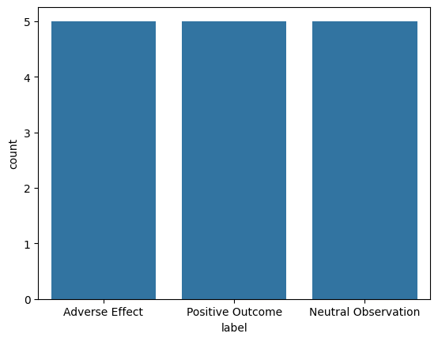
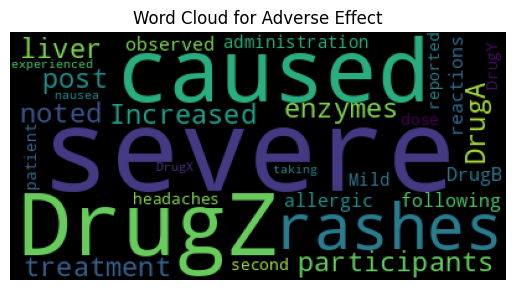
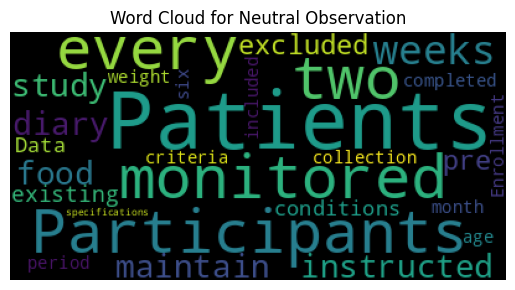
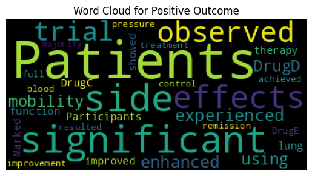
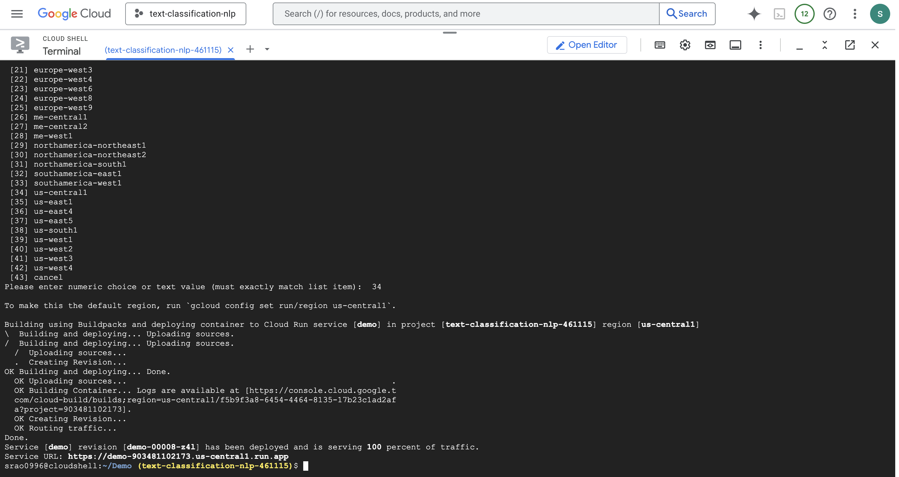
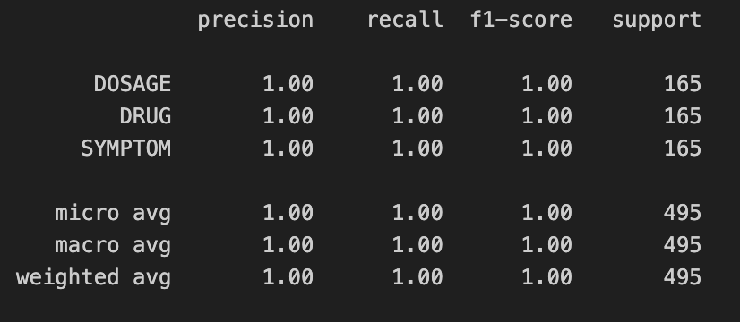

# ATEN SECURITY TECH CHALLENGE - SNEHA RAO

The following challenge was implemented using Python 3.10. All the models were trained and tested on MacOS M1 with 16 GB RAM.

## Task 1: Sentence Classification

In this task we classify sentences into three categories (Adverse Effect, Positive Outcome, Neutral Observation) using a transformer model. We then evaluate performance with accuracy and F1 score, and generate predictions on new sentences.

### Data preprocessing 

The initial dataset contained 1,000 data points, but upon analysis, it was found that 985 of these entries were duplicates. This presents a challenge of training a transformer model with only 15 unique data points.

Another key issue with this task is that standard stopword removal techniques could not be applied, as doing so would alter the meaning of the sentences. For instance - 

-  Initial Sentence - 
`no significant side effects were observed during the trial`
- After stopword removal - 
` significant side effects were observed during the trial`

Therefore, it was essential to preprocess the data carefully, while also augmenting the dataset with additional data points to facilitate the transformer model's learning process. This ensured that the model had sufficient variation and context to capture meaningful patterns despite the limited number of unique entries. 

Before applying any augmentation or preprocessing technique, EDA was performed to understand the balance of data across 3 labels and also to understand on how different words in a sentence influence the classification of a label. 

Firstly, class imbalance was checked, as shown in the figure below. The data was distributed equally among classes:



Following that, a word cloud was generated showing how different terms influence their classification into each class:







The following preprocessing steps were applied to the dataset:

- Named Entity Removal:
    - Identifies and removes named entities (e.g., names of people, organizations) to avoid overfitting on specific terms that may not generalize well across the dataset.
- Whitespace Normalization:
    - Strips extra spaces and normalizes the text by replacing multiple spaces with a single space, ensuring consistent word separation.
- Lowercasing:
    - Converts all text to lowercase to standardize the text and ensure that words are treated as identical regardless of case.
- HTML Tag Removal:
    - Removes HTML `<br>` tags to avoid introducing irrelevant characters that may appear in web-scraped data.
- Hyphen Removal:
    - Replaces hyphens with spaces to handle compound words and ensure the model treats them as individual tokens.
- Punctuation and Digit Removal:
    - Eliminates punctuation marks and digits as they do not contribute significant meaning for most NLP tasks, helping the model focus on words.
- Lemmatization:
    - Reduces words to their base form (e.g., "running" → "run"), helping the model generalize better by treating different word forms as a single entity.

After preprocessing the data, I applied various augmentation techniques to introduce sentence variations. Specifically, I experimented with three augmentation methods, namely: 

* Contextual Augmentation – Utilizes BERT for generating contextually relevant variations of sentences.

* Synonym Augmentation – Replaces words with their synonyms using WordNet to introduce semantic diversity.

* Random Word Augmentation – Randomly inserts, deletes, or swaps words to create varied sentence structures.

The performance of these three augmentation techniques was evaluated using the `distilbert/distilbert-base-uncased` model. Once the models were trained they were tested on 5 random sentences. Although all variations achieved an accuracy of 100% and an F1 score of 1.0 on the training data, their performance varied when tested on five different unseen sentences. 

| Augmentation Technique | Performance (Accuracy %) |
| ----------------------------  | ------------------------------- |
| **Contextual Augmentation** | 90   |
| **Synonym Augmentation**   | 70   |
| **Random Word Augmentation** | 80   |
| **All three together** | 80   |

From the above analysis, it was found that contextual augmentation performed the best among all 4 different combinations. 

### Transformer Training

#### Training Configuration

The training for all transformer models was conducted with the same set of training arguments, which ensured consistent evaluation across different architectures. Below is a detailed explanation of the training configuration:

```python
training_args = TrainingArguments(
    output_dir="/tmp/results",                # Directory to store the results after training.
    evaluation_strategy="epoch",              # Evaluation occurs at the end of every epoch.
    learning_rate=5e-5,                       # The learning rate for the optimizer.
    per_device_train_batch_size=16,           # Batch size for training on each device.
    per_device_eval_batch_size=16,            # Batch size for evaluation on each device.
    num_train_epochs=23,                      # Number of training epochs.
    weight_decay=0.001,                       # Weight decay for regularization to prevent overfitting.
    logging_dir="/tmp/logs",                  # Directory to store logs during training.
    logging_steps=10,                         # Log every 10 steps.
    save_strategy="epoch",                    # Model is saved at the end of each epoch.
    load_best_model_at_end=True,              # Load the best model based on evaluation performance at the end.
    warmup_steps=500,                         # Gradually ramps up the learning rate during the first 500 steps.
)
```

#### Explanation of Key Parameters:

* **`output_dir`**: Specifies the directory where the model and training results will be stored.
* **`evaluation_strategy`**: Defines how often to run evaluations (in this case, after every epoch).
* **`learning_rate`**: Controls how quickly the model's weights are updated during training.
* **`per_device_train_batch_size`** and **`per_device_eval_batch_size`**: Set the batch size used for training and evaluation, respectively.
* **`num_train_epochs`**: The number of times the model will be trained on the entire dataset.
* **`weight_decay`**: Used for regularization to prevent overfitting by penalizing large weights.
* **`logging_dir`**: Directory to store logs generated during training for tracking progress.
* **`logging_steps`**: Specifies how frequently to log the training progress.
* **`save_strategy`**: Determines when to save the model during training, in this case, at the end of every epoch.
* **`load_best_model_at_end`**: Ensures that the best-performing model (based on evaluation metrics) is used at the end of training.
* **`warmup_steps`**: Gradually increases the learning rate during the first 500 steps to avoid instability during training.

This training configuration was applied consistently across all transformer models to ensure fair comparison in terms of performance and generalization.


#### Benchmarking models

I explored various transformer models for sentence classification. The models chosen represent different trade-offs in terms of size, performance, and computational requirements. When trained all the models achieved an accuracy of 100% and F1 score of 1.0. They were then tested on 10 unsceen sentences. Below is a breakdown of the models used and their observed performance:

| model | Performance (Accuracy %) | F1 score |
| ----------------------------  | ------------------------------- | ------------------------------- |
| **sentence-transformers/all-MiniLM-L6-v2**   | 60   | 0.62 |
| **prajjwal1/bert-tiny** | 40   | 0.31 |
| **distilbert/distilbert-base-uncased** | 90   | 0.91 |

### Deployment on GCP

The trained transformer model was then deployed using Flask, and Waitress, a production WSGI server. The model is served through Google Cloud Platform (GCP) to make real-time predictions for text classification. 

Flask is a Python web framework to handle HTTP requests and responses, used to build the web application while Waitress is a  production-ready WSGI server that runs the Flask app in a multi-threaded environment.

#### Running the Application Locally

1. **Clone the Repository:**

   ```bash
   git clone <repository_url>
   cd <repository_folder>
   ```

2. **Install Dependencies:**
   The necessary Python packages can be installed using `pip`:
   ```bash
   pip install -r requirements.txt
   ```

   Also run the command to download spacy packages - 

   ```
    python3.10 -m spacy download en_core_web_sm
   ```

3. **Running the Flask App:**
   To start the Flask app locally, run:

   ```bash
   python main.py
   ```

4. **Accessing the App:**
   Open your browser and go to `http://127.0.0.1:8080`. You should see the homepage where you can input text for classification.

1. **Homepage**: The homepage (index.html) displays a form where you can input text for classification.
2. **Prediction**: After entering the text, click predict, and the model will predict the class for the entered text, displaying the result below the form.

#### Deploying on GCP

To deploy the codebase on GCP, I uploaded all the files on GCP cloud run. To deploy the code, I then ran the following command - 

```
gcloud run deploy
```

A screenshot, of the terminal output is shown - 




A quick demo outlining the hosted application is shown below - 


The app is hosted on the following URL - 

```
https://demo-903481102173.us-central1.run.app/
```
Example:

* Input: "The patient experienced severe nausea after medication."
* Output: "Adverse Effect"

## Task 2: NER Classification

The task involves performing Named Entity Recognition (NER) to extract specific entities such as Drug Name, Symptom, and Dosage from text.

### Data preprocessing 

With the NER data, the following data preprocessing techniques were applied - 
1. Use regex to identify tokens starting with "Drug" and updates their "O" tags to "B-DRUG" for drug entity recognition.
2. Removing duplicate data instances. 
3. BERT tokenization - 
    - Subword Tokenization: BERT splits words into subwords (e.g., "Washington" → ["Wash", "##ing", "##ton"]) and aligns labels to these subwords using strategies like labeling only the first subword and setting others to -100.
    - Tokenization & Input Preparation: Add [CLS] at the start and [SEP] at the end, pad/truncate to max_length, and create inputs such as input_ids, attention_mask, and labels where labels are aligned with tokenized words, and padding is filled with -100.

### Transformer training 

Once the dataset is processed, different models are benchmarked to find the best transformer model. 

| model | Performance (Accuracy %) | Inference time (s) | F1 score |
| ----------------------------  | ------------------------------- | ------------------------------- | ------------------------------- |
| **dslim/distilbert-NER** | 100   | 0.034 | 1.0 |
| **dslim/bert-base-NER**   | 83.33   |0.061 | 0.625 |
| **Clinical-AI-Apollo/Medical-NER** | 83.33   |0.126 | 0.625 |

As it can be seen that `dslim/distilbert-NER` performed the best at testing and had the best inference time when tested over 100 iterations. The final classification report - 

